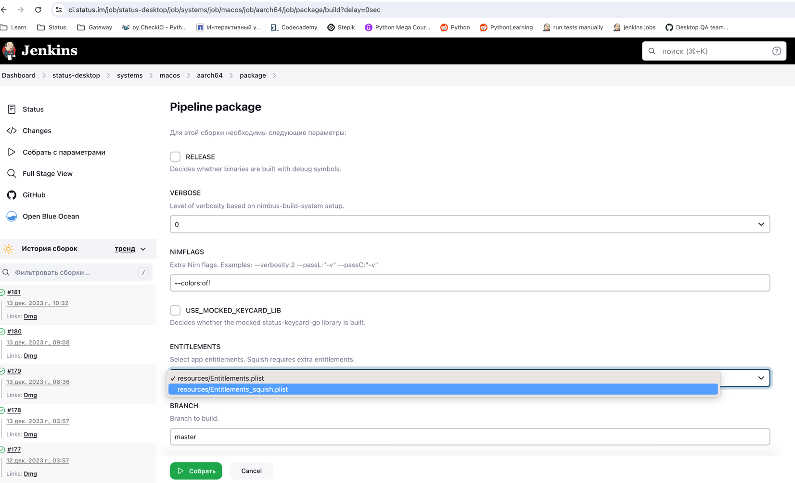

# This repository manages UI tests for desktop application

## How to set up your environment

1. **MacOS**: https://www.notion.so/Mac-arch-x64-and-Intel-50ea48dae1d4481b882afdbfad38e95a
2. **Linux**: https://www.notion.so/Linux-21f7abd2bb684a0fb10057848760a889
3. **Windows**: https://www.notion.so/Windows-fbccd2b09b784b32ba4174233d83878d
 
**NOTE:** when MacOS and Linux are proven to be working, Windows guide could be outdated (no one yet set up Windows)

## Which build to use

1. you _can_ use your local dev build but sometimes tests hag there. To use it, just place a path to the executable to AUT_PATH in your _local.py config,
for example `AUT_PATH = "/Users/anastasiya/status-desktop/bin/nim_status_client"`

2. normally, please use CI build. Grab recent one from Jenkins job https://ci.status.im/job/status-desktop/job/nightly/

    **2.1** Linux and Windows could be taken from nightly job
    

    **2.2** Mac **requires entitlements**  for Squish which we don't add by default, so please go here https://ci.status.im/job/status-desktop/job/systems/job/macos/
and select architecture you need (arm or intel), click Build with parameters and select Squish entitlements. Select a branch if u like (master is default)
    

## Pytest marks used

You can run tests by mark, just use it like this in command line:

```bash
python3 -m pytest -m critical
```

or directly in pycharm terminal:

```bash
pytest -m critical
```

You can obtain the list of all marks we have by running this `pytest --markers`

- `critical`, mark used to select the most important checks we do for PRs in desktop repository 
(the same for our repo PRs)
- `xfail`, used to link tests to existing tickets in desktop, so if test fails it will be marked as
expected to fail in report with a reference to the ticket. At the same time, if such test is passing,
it will be shown as XPASS (unexpectedly passing) in report, which will indicate the initial bug is gone
- `skip`, used to just skip tests for various reasons, normally with a ticket linked
- `flaky`, used to mark the tests that are normally passing but sometimes fail. If such test passes, then
if will be shown as passed in report normally. If the test fails, then the total run wont be failed, but 
the corresponding test will be marked as `xfail` in the report. It is done for a few tests that are not super
stable yet, but passes most of the time. This mark should be used with caution and in case of real need only.
